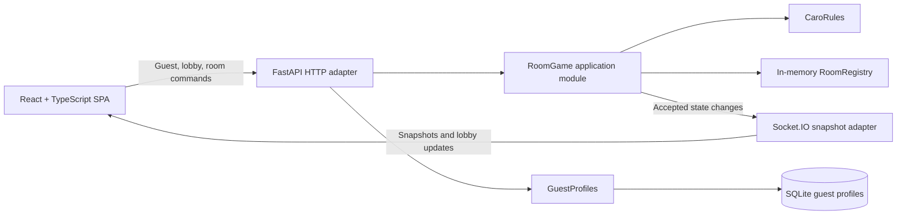

# Software Architecture Design

## Status

Draft for review. This document defines the MVP target architecture from the product brief and approved design sections. It does not describe an existing implementation: the repository currently has no application source or dependency manifests.

## Goals

- Let two guests create or join a room and play a complete Caro match from separate browsers.
- Keep identity and game rules server-authoritative.
- Deliver room changes to both players in real time.
- Keep the MVP small: guest profiles persist, while rooms and games remain ephemeral.
- Keep game rules and room transitions independently testable.

## Non-goals

Accounts, login, OAuth, room passcodes, durable rooms, match history, rankings, replays, chat, undo, spectators, matchmaking, AI opponents, timers, advanced Caro rules, native mobile apps, and guaranteed recovery of a room seat after refresh or disconnection.

## Architecture Overview

Use a modular monolith: one React/Vite frontend and one FastAPI application with Socket.IO, mounted as an ASGI application and served by Uvicorn. The backend runs as one process and one worker. HTTP handles guest, lobby, and room commands. Socket.IO distributes canonical room snapshots and lobby updates.

All game and room commands pass through one `RoomGame` module. HTTP handlers and Socket.IO disconnect cleanup call that same module; transport handlers do not implement game rules. The module serializes mutations, validates current state, applies accepted transitions, and returns snapshots. A pure `CaroRules` module owns legal move, win, and draw calculations.

Guest profiles use SQLite. Rooms and active games use in-process memory only. No database, cache, or message broker stores room state.

## Modules and Interfaces

| Module | Responsibility | Interface and constraints |
| --- | --- | --- |
| React/Vite SPA | Guest entry, lobby, room, and board rendering | Sends HTTP commands; subscribes to Socket.IO updates; renders server snapshots without optimistic game-state changes. |
| FastAPI HTTP adapter | Guest profile, joinable-room queries, and room commands | Resolves guest identity from the server-issued cookie; validates request shape; delegates all room transitions to `RoomGame`. |
| Socket.IO adapter | Deliver room snapshots and lobby updates | Authorizes room subscriptions against current membership. Disconnect invokes the same idempotent leave operation as an explicit leave command. |
| `RoomGame` | Own room lifecycle, authorization, transitions, and snapshot creation | Small command/query surface: create, join, leave, start, move, new game, and list joinable rooms. Rejects invalid transitions without changing state. |
| `RoomRegistry` | Store active rooms in process memory | Internal to `RoomGame`; enforces capacity and serializes room mutations to prevent races. Data is lost on process restart. |
| `CaroRules` | Evaluate board and move rules | Pure operations over board state; no transport, database, or room ownership dependencies. |
| `GuestProfiles` | Create and retrieve guest profiles | Persists `id` and `display_name` in SQLite. Guest profile persistence is independent of room lifecycle. |

### Command and update flow

1. The browser sends a command using its server-issued guest cookie.
2. The HTTP adapter validates the request shape and resolves the guest profile.
3. `RoomGame` serializes the transition, checks room membership, ownership, status, and game rules, then applies or rejects the command.
4. An accepted command returns the latest snapshot in its HTTP response. The Socket.IO adapter broadcasts the updated snapshot to seated players and updates the joinable-room list when its contents change.
5. The frontend renders the response or broadcast snapshot. A rejected command returns a stable error code; it leaves server state unchanged.

Socket.IO room membership is a delivery mechanism, not authorization. The server verifies current room membership before subscribing a connection. Clients never choose their own symbol, room ownership, winner, or next turn.

### Snapshot contents

A room snapshot contains the room identifier, a monotonically increasing room revision, status, player names and symbols, 15×15 board, whose turn it is while playing, and win/draw result when finished. The server sends the same canonical game state to both players; each client ignores snapshots older than its latest applied revision and derives presentation and available controls from its own guest identity and snapshot.

## State and Persistence

### Guest identity

The server assigns each guest a high-entropy `userId` and stores the profile in SQLite. The browser stores the `userId` and display name in a cookie. Set `HttpOnly` and `SameSite=Lax`; set `Secure` when served over HTTPS. The frontend obtains the canonical display name through the guest profile interface rather than reading the cookie. The backend resolves identity by `userId` and uses the database profile as the canonical name; it never trusts a client-provided name, symbol, or ownership claim.

Guest identity is not account authentication. There are no passwords or account recovery. The guest cookie must not be logged.

### Rooms and games

The `RoomRegistry` owns room state for the lifetime of the backend process. A room contains at most two seats, its owner, game status, board, current turn, and result. The owner is X; the joining guest is O. X starts each game.

Room transitions follow the product rules:

- A created room starts waiting and is joinable only while waiting with fewer than two players.
- Joining fills O's seat but does not start the game.
- Only the owner can start when both seats are filled.
- Only a legal move by the current player changes the board or turn.
- Five or more consecutive marks in a straight horizontal, vertical, or diagonal line wins. Check for a win before a full-board draw.
- A win or draw leaves the board unchanged. Only the owner can start a new game, and only while both players remain.
- Leave removes the player's seat. An empty room is deleted. If the owner leaves while another guest remains, the room closes. If O leaves while waiting, the owner remains and the room becomes joinable again. If O leaves after play starts, the room remains unavailable and no winner is declared.

The single-process design serializes room mutations so simultaneous joins, moves, and lifecycle commands cannot violate room invariants. Room state is not restored after a restart.

## API and Error Handling

The HTTP interface exposes guest profile creation/retrieval, joinable-room listing, and commands for create, join, leave, start, move, and new game. Exact route paths and payload schemas belong to the implementation plan and API contract work.

Socket.IO distributes room snapshots and joinable-room updates. The client subscribes only while seated in a room. A refresh or tab close releases the seat; the guest cookie remains available, but the former seat and board are not restored.

Transport adapters return stable machine-readable error codes for invalid names, unavailable rooms, full rooms, authorization failures, illegal moves, and invalid state transitions. The Vietnamese UI maps these codes to user-facing messages. Validation errors do not mutate room state. Error responses do not expose stack traces, database details, cookie contents, or other implementation information.

## Runtime and Deployment

- Frontend: React + TypeScript, built and served as a Vite single-page application.
- Backend: Python 3.12+ with FastAPI and `python-socketio`, mounted as ASGI and served by Uvicorn.
- Development: Vite proxies HTTP and Socket.IO traffic to the FastAPI server to avoid cross-origin setup.
- Runtime: one backend instance and one Uvicorn worker. Multiple workers or instances would create divergent in-memory room registries and are unsupported.
- Persistence: SQLite stores guest profiles only. Its file must be on persistent storage if guest names should survive deployment restarts.
- Restart behavior: guest profiles remain when SQLite storage is retained; all rooms and games are lost. Clients with stale room views return to the lobby with an unavailable-room message.
- Deployment platform and production topology are not selected by the product brief and remain outside this design.

## Security and Reliability

- Treat the server as authoritative for guest identity, room ownership, seat assignment, symbols, turn order, board state, and results.
- Validate every client-controlled command and board coordinate at the backend boundary.
- Use unpredictable server-issued guest identifiers; resolve their canonical profiles server-side.
- Do not log guest cookies. Return actionable Vietnamese messages through stable error codes without exposing internals.
- A Socket.IO disconnect applies the approved Leave behavior. There is no transient-disconnect grace period, seat recovery, or replay of missed room events.
- If SQLite is unavailable, guest profile operations fail rather than silently switching to volatile storage. Room operations remain process-local and are unavailable after a backend restart until new rooms are created.

## Validation Strategy

- Unit tests for `CaroRules`: horizontal, vertical, and diagonal wins; overlines; occupied and out-of-board cells; turn rules; moves after results; and the last-cell win-before-draw case.
- `RoomGame` tests using in-memory dependencies: room capacity, ownership, join races, explicit start, turn enforcement, leave outcomes, room deletion, result locking, and new-game permissions.
- SQLite adapter tests for guest creation, lookup, name persistence, and restart persistence.
- HTTP and Socket.IO integration tests with two clients: accepted and rejected commands, canonical snapshots, lobby updates, authorization, disconnect-as-leave, and process-restart room loss.
- Frontend tests for snapshot rendering, out-of-order snapshot rejection, Vietnamese loading/error/result states, and controls matching room state without optimistic board updates.
- One two-browser end-to-end happy path: create, join, owner starts, players complete a game, both see the result, owner starts a new game.

## Decisions and Source Alignment

- **Stack:** Use React/TypeScript/Vite, FastAPI, Socket.IO, SQLite guest profiles, in-memory rooms, and one Uvicorn worker as specified by `docs/knowledge/product-brief.md`. The README says to verify stack from implementation, but no application code or manifests exist yet; the user approved the product brief as the target stack.
- **Refresh and reconnect:** `docs/meeting-notes.md` says identity should be used when reconnecting or refreshing. `docs/knowledge/caro-business-rules.md` and the product brief do not guarantee restoration of a room seat, and the business rules say room refresh or tab close counts as Leave. User confirmed this design follows the current business rules: retain guest identity, release the seat, and require the guest to create or join a room again.
- **Out of scope:** Do not add accounts, multi-instance room storage, automatic game starts, automatic restarts, or reconnect/resume behavior without an explicit product decision.

## Open Decisions

- Maximum display-name length and allowed-character policy are not specified. The implementation must reject blank or whitespace-only names and should not invent additional policy without product confirmation.
- Production hosting platform and deployment topology are not specified.
- Exact HTTP routes, payload schemas, Socket.IO event names, and dependency versions are implementation details to define before implementation.