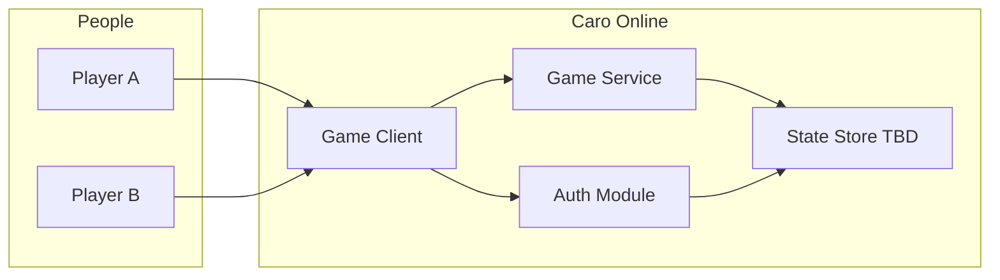
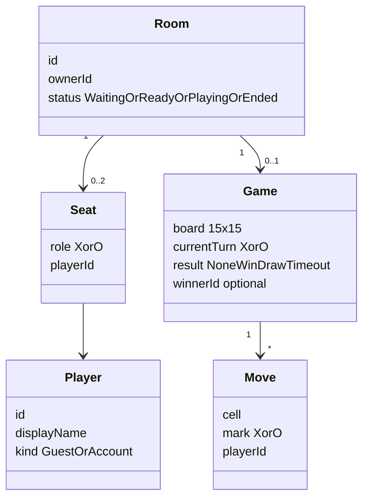
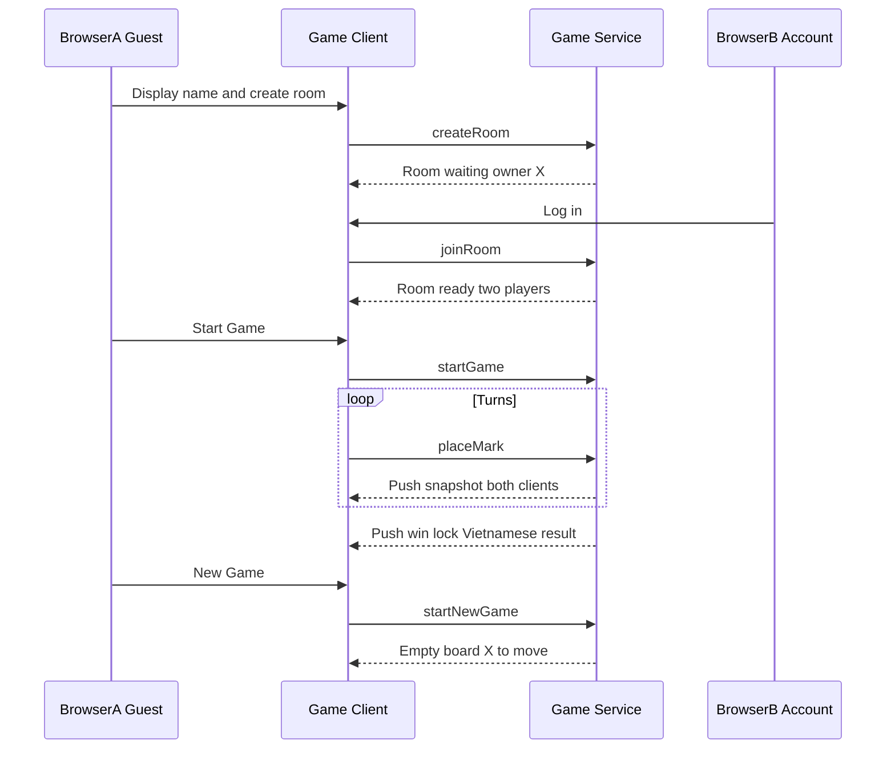

# Software Architecture Document (SAD)

| Field | Value |
| --- | --- |
| System | Voodoo AI Native — Caro Online |
| Version | 0.3 (workshop MVP) |
| Status | Approved 2026-09-21 — SAD locked; SSE snapshot push |
| Date | 2026-09-21 |
| AI-DLC phase | INCEPTION — Application Design |
| Scope sources | `docs/product-brief.md`, `docs/meeting-notes.md`, `README.md` |

This document is the workshop Software Architecture Document. It is technology-agnostic. It consolidates the AI-DLC Application Design artifacts (components, methods, services, dependencies) into one file under `docs/` for team review.

---

## 1. Purpose

Define the architecture for the current workshop MVP: two people, in two browsers, can create or join a room, play a legal 15×15 Caro match, see a Vietnamese result, and start a new game in the same room.

The SAD answers:

- What is in scope and what is not.
- Which logical modules and services exist.
- Where game rules are enforced.
- How identity, rooms, and play interact.
- Which decisions are closed and which remain TBU.

---

## 2. Architectural principles

1. Prefer one complete vertical slice over many incomplete features.
2. Game rules are deterministic and independently testable.
3. The Game Service is authoritative for turns, cells, occupancy, and results. The client must not be trusted for legality.
4. Guest play is always available. Authentication must never block play.
5. Keep the MVP small enough for a five-minute demo.
6. Do not add out-of-scope features without an explicit product decision.
7. All user-facing copy is Vietnamese.
8. Do not assume a frontend framework, database, or cloud vendor until NFR Requirements records a stack decision.

---

## 3. Scope

### 3.1 In scope (MVP)

| Capability | Behavior |
| --- | --- |
| Play Caro | 15×15 board, X first, alternate turns, empty-cell-only moves, five or more in a line wins, full board is a draw, board locks on end |
| Turn timeout | 20-second turn timer; no move before expiry loses; timer resets on turn change |
| Online room | Create, list available, join, leave; max two players; creator is owner and X; second player is O |
| Match lifecycle | Owner starts the first game explicitly; owner starts a new game after win/draw only when two players remain; never auto-start or auto-restart |
| Optional auth | Email/password sign up, log in, log out; guests play with a display name |
| Guest identity | Unique client identity; cookie may retain userId for the participation session |
| UI | Vietnamese copy; board, names, symbols, turn, countdown, result, available actions |
| Demo | Two browsers; one seeded account is enough to show optional login |

### 3.2 Out of scope

- Mandatory login before play
- Match history, rankings, replays, move clocks besides the 20s turn timer
- Email verification, password reset, OAuth / social login
- AI opponent
- Chat, undo, spectators, ranked matchmaking
- Advanced Caro rules (blocked heads, Swap2, 3×3 restrictions)
- Native mobile applications
- Complex reconnect / resume after refresh or tab close as a guaranteed product feature
- Room passcodes
- Persistence of rooms across process restart (Phase 1 meeting notes)

### 3.3 Source conflicts (resolved for this SAD)

| Topic | Product brief | Meeting notes | SAD baseline |
| --- | --- | --- | --- |
| Source of truth | Hosted DB | In-memory rooms | In-memory in one Game Service process. Game Service is still authoritative. |
| Reconnect | Losing session on refresh is OK | Cookie userId rejoin | Guest cookie may keep identity. Board resume after refresh or tab close is not guaranteed. |
| Lobby | “Matchmaking lobby” out of scope | List available rooms | Simple available-room list is in scope. Ranked/queued matchmaking is not. |
| Backend | “none” | Game API required | Same modular monolith, same origin. Game Service is an in-process module, not a separate deployable. |
| Sync | (unset) | Game API returns state | HTTP commands + **SSE** snapshot push to both seated clients. |

---

## 4. Stakeholders and quality concerns

| Stakeholder | Concern |
| --- | --- |
| Casual player (Vietnam) | Fast guest entry, clear Vietnamese UI, fair turns |
| Room owner | Start / new game control, visible room identity |
| Workshop facilitator | Five-minute demo, two-browser path, seeded login |
| Developer / AI agent | Testable rules, small surface, no invented stack |
| Tester | Deterministic rules, observable API/UI states, accessibility |

Quality attributes for the thin NFR set:

| Attribute | Requirement |
| --- | --- |
| Language | UI Vietnamese |
| Access | Play never behind login |
| Capacity | Two players per room |
| Honesty of state | Server/service state wins over client |
| Auth | Email/password only; email verification disabled |
| Persistence | In-memory; room lives while occupied and while the process lives |
| Accessibility | Keyboard board, visible focus, readable contrast, cell labels |
| Demo reliability | Two concurrent browsers on one room |

No production SLO, multi-region, or scale target is specified. Do not design for those.

---

## 5. Context view

### Mermaid (system context)



### Text alternative

- Player A and Player B each use a browser Game Client.
- Game Client talks to Game Service for rooms, moves, start/new game, leave, and current state.
- Game Client talks to Auth Module for optional sign up / log in / log out.
- Game Service and Auth Module read/write the State Store (adapter TBU).
- No other external systems are in MVP scope (no email provider, no OAuth, no AI, no analytics requirement).

---

## 6. Logical containers

Workshop style: **modular monolith, same origin**. One deployable process serves the Game Client and the Game Service.

| Container | Type | Responsibility |
| --- | --- | --- |
| Game Client | Browser application | Vietnamese UI: lobby, board, identity prompts, auth forms, status |
| Game Service | In-process authoritative module | Rooms, occupancy, ownership, moves, win/draw/timeout, start/new game, push snapshots |
| Auth Module | In-process module | Optional email/password accounts; never required for play |
| State Store | In-memory adapter | Holds rooms, games, optional accounts. Lost on process restart. |

Sync contract: after each legal command (and on timer expiry), Game Service **pushes** the canonical snapshot to both seated clients over **SSE**. Commands stay on same-origin HTTP. Polling is not the primary sync path. WebSocket is out for MVP.

---

## 7. Components and responsibilities

### 7.1 Game Client modules

| Component | Purpose | Responsibilities |
| --- | --- | --- |
| LobbyView | Enter play | Show available rooms; create room; join room; collect guest display name when unsigned |
| BoardView | Play | Render 15×15 cells; keyboard and pointer input; disable illegal cells; lock on end |
| MatchStatusView | Situation awareness | Names, X/O, whose turn, 20s countdown, Vietnamese result, owner actions |
| AuthView | Optional account | Sign up, log in, log out; never gate lobby or board |
| ClientSession | Local identity | Guest display name; cookie userId when supported; attach identity to commands |
| GameClientGateway | Talk to Game Service | Send commands; subscribe to server push; apply snapshots; surface errors in Vietnamese |

### 7.2 Game Service modules

| Component | Purpose | Responsibilities |
| --- | --- | --- |
| RoomRegistry | Lobby truth | Create, list available, join, leave, delete empty rooms, assign owner/X/O |
| MatchLifecycle | Start control | First Start Game only by owner with two players; New Game only after win/draw with two players |
| GameEngine | Rules | Board, turn, legal move, win (five or more, four directions), draw (full board) |
| TurnTimer | Timeout | 20s per turn; expiry marks current player as loser; reset on valid move / new game |
| CommandGuard | Honesty | Reject occupied cell, wrong turn, move after end, start/new-game by non-owner, join when full |
| StateProjector | Sync | Build canonical room+game snapshot after every command, on read, and on timeout |
| StateBroadcaster | Push | Push that snapshot to both seated clients over **SSE** |

### 7.3 Auth module

| Component | Purpose | Responsibilities |
| --- | --- | --- |
| AccountStore | Credentials | Email/password create and verify; no email verification |
| SessionIssuer | Signed-in identity | Establish and clear session; expose account display name to rooms |

---

## 8. Component methods (interfaces)

Detailed algorithms belong in CONSTRUCTION Functional Design. These signatures are the Application Design contracts.

### RoomRegistry

| Method | Input | Output | Purpose |
| --- | --- | --- | --- |
| `listAvailableRooms` | none | room summaries | Lobby list |
| `createRoom` | player identity | room snapshot | Creator becomes owner and X; waiting |
| `joinRoom` | room id, player identity | room snapshot or error | Second player is O; reject if full or missing |
| `leaveRoom` | room id, player identity | empty / updated room | Drop membership; delete room if empty |

### MatchLifecycle

| Method | Input | Output | Purpose |
| --- | --- | --- | --- |
| `startGame` | room id, owner identity | game snapshot or error | First game; two players; owner only; does not auto-fire on join |
| `startNewGame` | room id, owner identity | game snapshot or error | After win/draw only; two players; reset board; X first; reset timer |

### GameEngine / CommandGuard

| Method | Input | Output | Purpose |
| --- | --- | --- | --- |
| `placeMark` | room id, player identity, cell | game snapshot or error | Validate turn, emptiness, not ended; apply X/O; evaluate win/draw; switch turn |
| `getSnapshot` | room id | room+game snapshot | Authoritative read for UI sync |
| `onTurnTimeout` | room id, expected turn token | game snapshot | Current player loses; lock board |

### Auth

| Method | Input | Output | Purpose |
| --- | --- | --- | --- |
| `signUp` | email, password, account name | session | Create account |
| `logIn` | email, password | session | Existing account |
| `logOut` | session | none | Clear session; guest play remains possible |

### Client identity rule

- Guest: display name required to enter a room; userId generated and may be stored in a cookie.
- Signed-in: account name is the room name; no extra guest-name prompt.

---

## 9. Services (orchestration)

Services coordinate modules. They are not independently deployable in the MVP monolith.

| Service | Orchestration |
| --- | --- |
| PlayerSessionService | Resolve guest cookie vs account session; supply identity to room commands |
| RoomOrchestrationService | create/join/leave + list; enforce two-player cap and owner assignment |
| MatchOrchestrationService | start / new game guards; reset engine and timer |
| MoveOrchestrationService | guard + engine + timer reset + snapshot |
| TimeoutOrchestrationService | timer expiry → engine end state → StateBroadcaster |
| SyncOrchestrationService | subscribe client to room channel; push snapshots; drop on leave |
| AuthOrchestrationService | sign up / log in / log out without blocking lobby |

---

## 10. Component dependencies

```
Game Client
  -> PlayerSessionService
  -> AuthOrchestrationService
  -> RoomOrchestrationService
  -> MatchOrchestrationService
  -> MoveOrchestrationService

RoomOrchestrationService -> RoomRegistry -> State Store
MatchOrchestrationService -> RoomRegistry, GameEngine, TurnTimer -> State Store
MoveOrchestrationService -> CommandGuard, GameEngine, TurnTimer, StateBroadcaster -> State Store
TimeoutOrchestrationService -> TurnTimer, GameEngine, StateBroadcaster -> State Store
SyncOrchestrationService -> StateBroadcaster -> State Store
AuthOrchestrationService -> AccountStore, SessionIssuer -> State Store
PlayerSessionService -> ClientSession, SessionIssuer
```

Allowed dependency direction: Client → Services → Domain modules → State Store adapter.

Forbidden: Client mutating board truth; Engine depending on UI; Auth gating RoomRegistry.

### Communication patterns

| From | To | Pattern |
| --- | --- | --- |
| Client | Game Service | Synchronous command (HTTP or equivalent TBU) on same origin |
| Game Service | both clients | SSE push of snapshot |
| TurnTimer | TimeoutOrchestrationService | In-process callback / scheduler |
| Client | Auth Module | Synchronous command, same origin |

---

## 11. Domain model



### Text alternative

- Room has an owner and up to two seats (X, O).
- Waiting: fewer than two players. Ready: two players, no active game or game not started. Playing: game in progress. Ended: win, draw, or timeout; board locked.
- Game holds 225 cells, current turn, result, optional winner.
- Empty rooms are removed. Rooms need not survive process restart.

### Ubiquitous language

| Term | Meaning |
| --- | --- |
| Room | Shared session for at most two players |
| Owner | Room creator; plays X; only actor who may Start Game / New Game |
| Guest | Player without account; display name + generated userId |
| Account | Optional email/password identity; name used in room |
| Start Game | Owner action that begins the first match |
| New Game | Owner action after win/draw that resets board; X first |
| Legal move | Empty cell, correct turn, game not ended |
| Win | Five or more consecutive same marks, horizontal, vertical, or either diagonal |
| Draw | 225 filled cells and no win |
| Timeout | 20s elapsed with no legal move; current player loses |

---

## 12. Runtime flows

### 12.1 Demo happy path



### 12.2 Command rules (always)

1. Identify player (guest userId or account).
2. Load room; fail if missing.
3. Authorize (owner-only for start/new game; seated player for move).
4. Validate against current snapshot.
5. Mutate authoritative state.
6. Evaluate end conditions.
7. Push snapshot to seated clients. Both UIs render that snapshot only.
8. Refresh or tab close may keep guest cookie identity. Do not promise the same seat or board.

---

## 13. Data view

Minimum state for MVP (logical, not schema):

**Player:** `id`, `displayName`, `kind` (`guest` | `account`), optional `email` hash/credential ref.

**Room:** `id`, `ownerId`, `seats[2]`, `status`, `game` optional.

**Game:** `cells[15][15]` of empty|X|O, `currentTurn`, `startedAtTurn`, `deadlineAt`, `result`, `winnerSeat`.

No match-history records. No replay log required beyond what is needed to compute the current snapshot.

State Store is in-memory: all rooms vanish on restart. That is accepted for Phase 1.

---

## 14. Security and privacy (MVP)

| Control | Rule |
| --- | --- |
| Play access | Unauthenticated guests allowed |
| Auth | Email/password; verification off |
| Authorization | Owner checks on start/new game; seat checks on move |
| Integrity | Server validates every move |
| Secrets | No credentials in git; do not log passwords |
| PII | Email and display name only; no extra profile |
| Session | Guest cookie may persist identity; it does not restore a match after refresh |

Threats explicitly accepted for workshop: no rate-limit SLO, no CSRF/session library chosen yet, no production hardening. Stack-level controls belong in NFR Design after tech selection.

---

## 15. Deployment view

Workshop day:

- One process, same origin: static/UI + Game Service + Auth + in-memory store.
- **Single instance required.** In-memory rooms plus push connections will split if two processes exist.
- No VPC, CDN, or multi-region design.
- SSE snapshot channel on the same process. Runtime / frontend framework stay TBU in NFR Requirements.

Operations phase is an AI-DLC placeholder. No production monitoring design in this SAD.

---

## 16. Units of work (proposed)

Single modular monolith unit: **Caro Online MVP**.

Internal implementation slices (not separate deployables):

1. Identity (guest name, cookie userId, optional auth)
2. Rooms (create, list, join, leave, owner, occupancy)
3. Game engine (board, legal move, win/draw)
4. Match lifecycle (start, new game, lock)
5. Turn timer
6. Vietnamese UI + sync

Story placeholders from the product brief: US-01 / US-03 rooms, US-02 auth, US-04 play. Knowledge files named in the brief are not present in the repo yet.

---

## 17. Architecture decision record (workshop)

| ID | Decision | Status |
| --- | --- | --- |
| ADR-W1 | Modular monolith, not microservices | Accepted — workshop size |
| ADR-W2 | Authoritative Game Service; client is projection | Accepted — product honesty-of-state |
| ADR-W3 | Optional auth; guests first | Accepted |
| ADR-W4 | Explicit owner start / new game; no auto-start | Accepted |
| ADR-W5 | Win is five or more in a straight line on 15×15 | Accepted |
| ADR-W6 | In-memory State Store in one process | Accepted — Q1 = A |
| ADR-W7 | Same-origin modular monolith | Accepted — Q3 = A |
| ADR-W8 | HTTP commands + SSE snapshot push | Accepted — 2026-09-21 recommendation locked on SAD approval |
| ADR-W9 | Refresh does not restore the board | Accepted — Q4 = A |
| ADR-W10 | TypeScript, Node, Next.js App Router, client board + EventSource | Accepted — NFR Q5=A F3=A |

---

## 18. Risks

| Risk | Impact | Mitigation |
| --- | --- | --- |
| Stack still TBU | Implementation blocked | Resolve in NFR Requirements before code generation |
| In-memory + two instances | Split-brain rooms | Single instance until shared store exists |
| Timer in browser only | Cheating / desync | Timer owned by Game Service |
| Refresh not resumed | Demo confusion | Show Vietnamese “rejoin not guaranteed”; cookie id only |
| Brief vs notes drift | Wrong tests | This SAD is the architecture baseline until product revises it |

---

## 19. Traceability

| SAD area | Product feature | Sources |
| --- | --- | --- |
| GameEngine | Play Caro / US-04 | README game rules; meeting notes Game Engine |
| RoomRegistry | Online room / US-01 US-03 | product-brief core feature 2; meeting notes Lobby |
| Auth Module | Optional auth / US-02 | product-brief; README identity |
| TurnTimer | Timeout lock | meeting notes; README end conditions |
| MatchLifecycle | Start / New game | meeting notes Gameplay |
| Client Vietnamese UI | Copy / UX | product-brief language; README UX |

---

## 20. What this SAD does not choose

Do not infer these from the repo. They are unset:

- Exact Next.js / hasher / test-runner versions (picked at Code Generation)
- Session cookie flags beyond workshop localhost
- Process hosting beyond `next dev` / `next start` single instance
- Exact error code catalog (Vietnamese copy still required)

Locked in NFR: TypeScript, Node, Next.js App Router, SSE, in-memory, workshop security/test/a11y bars.

Still unset at Code Generation:

- Exact Next.js / hasher / test-runner versions
- Session cookie flags beyond workshop localhost
- Hosting beyond `next dev` / `next start` single instance
- Exact error code catalog (Vietnamese copy still required)

---

## 21. Next AI-DLC stages

NFR Design, then Infrastructure Design (thin: one Node process), then Code Generation.
