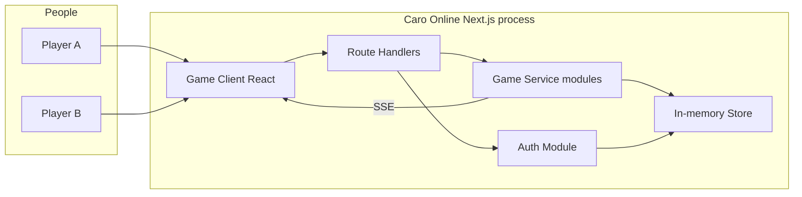
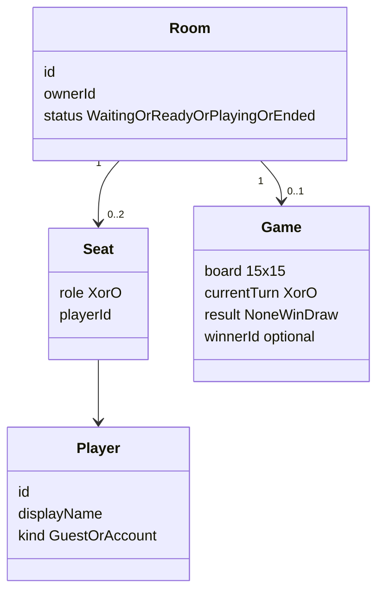
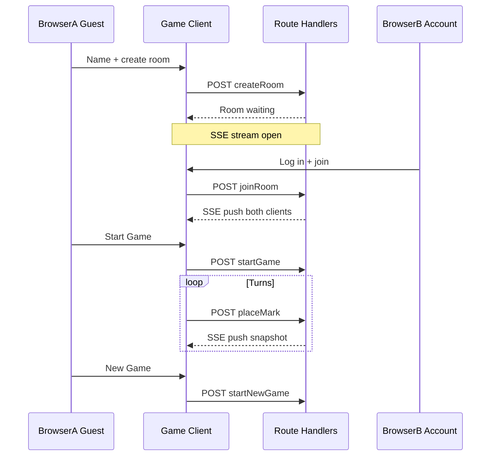

# Software Architecture Document (SAD)

| Field | Value |
| --- | --- |
| System | Voodoo AI Native — Caro Online |
| Version | 0.4 (workshop MVP) |
| Status | Draft 2026-09-25 — technology stack locked |
| Date | 2026-09-25 |
| Scope sources | `docs/product-brief.md`, `docs/meeting-notes.md`, `README.md` |

This document is the workshop Software Architecture Document. It defines logical architecture **and** the chosen technology stack for implementation. It consolidates application design (components, services, dependencies) into one file under `docs/` for team review.

---

## 1. Purpose

Define the architecture for the current workshop MVP: two people, in two browsers, can create or join a room, play a legal 15×15 Caro match, see a Vietnamese result, and start a new game in the same room.

The SAD answers:

- What is in scope and what is not.
- Which logical modules and services exist.
- Where game rules are enforced.
- How identity, rooms, and play interact.
- Which technology stack implements the design.
- Which decisions are closed and which remain open at code generation.

---

## 2. Technology stack (brainstorm and decision)

### 2.1 Constraints from the product

| Constraint | Implication |
| --- | --- |
| One workshop day, five-minute demo | Minimize moving parts and ops |
| Guest play never blocked by login | Auth is a side module, not a gateway |
| Two browsers, same room, live sync | Authoritative server + push updates |
| Vietnamese UI | Standard React i18n or static copy in components |
| `.envrc` pins Node 24 | Runtime must be Node 24–compatible |
| No match history, no scale SLO | In-memory room state is acceptable |

### 2.2 Options considered

| Option | Shape | Pros | Cons | Verdict |
| --- | --- | --- | --- | --- |
| **A — Same-origin Next.js monolith** (recommended) | Next.js App Router: pages + Route Handlers; in-process game modules; SSE push | One deployable, one language (TypeScript), aligns with harness; SSE simpler than WebSocket for one-way snapshots | Single instance only while state is in-memory | **Chosen** |
| B — SPA + separate API | Vite React + Express/Fastify on another port | Clear API boundary | CORS, two origins, extra dev wiring for workshop | Rejected |
| C — Hosted DB + realtime (e.g. Postgres + Supabase Realtime) | Client subscribes to DB changes | Durable rooms, familiar SQL | Overkill for MVP; auth/rules still need a server; conflicts with in-memory Phase 1 notes | Rejected for MVP |

### 2.3 Chosen stack

| Layer | Choice | Rationale |
| --- | --- | --- |
| Language | TypeScript | Shared types for engine, API payloads, UI |
| Runtime | Node.js 24 | Workshop harness (`.envrc`) |
| Application framework | Next.js (App Router), current stable at code generation | Same-origin UI + HTTP command handlers |
| UI | React; Server Components for shell pages; Client Components for board, lobby actions, `EventSource` | Board and SSE need client runtime |
| Commands | Next.js Route Handlers (`POST` / `GET`) | Synchronous command channel on same origin |
| Realtime sync | Server-Sent Events (`text/event-stream`) from a Route Handler | Push canonical snapshot after each command; one-way fan-out fits MVP |
| Room and game state | In-process memory (module singleton or equivalent registry) | Meeting notes: no persistence across restart; two players per room |
| Optional accounts | In-memory account map + hashed passwords | No email provider; verification disabled |
| Password hashing | `bcrypt` or `argon2` (pick at code generation) | Standard one-way hash |
| Guest identity | HTTP cookie: generated `userId`; `localStorage`: last guest display name | Cookie for session identity; local storage for “remember name” (product feature 3) |
| Signed-in session | HTTP session cookie (implementation detail at code generation) | Account name in room without guest-name prompt |
| Unit tests | Vitest or Node built-in test runner | Pure `GameEngine` tests without browser |
| Integration tests | HTTP + SSE against running Next server | Optional for workshop; not a merge gate |
| Hosting (workshop) | `next dev` or `next start`, **single instance** | In-memory + SSE connections break across multiple processes |

### 2.4 Rejected for MVP

| Technology | Reason |
| --- | --- |
| Separate microservices | Workshop size; modular monolith is enough |
| WebSocket | SSE sufficient for server → client snapshots |
| Redis / hosted database | In-memory lock for Phase 1; product persistence is room lifetime only |
| Java, C#, Python backends | Harness and team slice target TypeScript/Node |
| OAuth / social login | Out of scope |
| Playwright as mandatory CI gate | Optional demo aid only |

### 2.5 Code layout (greenfield, at repository root)

```
app/                    # Routes, pages, Route Handlers (commands + SSE)
lib/game/               # Pure GameEngine (unit-tested)
lib/rooms/              # RoomRegistry, seats, lifecycle
lib/sync/               # SSE subscriber registry and broadcast
lib/auth/               # Optional accounts and sessions
components/             # Board, lobby, auth UI (Vietnamese copy)
```

Application code does not live under documentation-only trees.

### 2.6 Open at code generation (not product forks)

- Exact Next.js major version (use current stable when scaffolding).
- `bcrypt` vs `argon2`.
- Vitest vs `node:test`.
- Session cookie flags (`httpOnly`, `SameSite`) for localhost workshop.
- Exact Vietnamese error message catalog.

---

## 3. Architectural principles

1. Prefer one complete vertical slice over many incomplete features.
2. Game rules are deterministic and independently testable in `lib/game/`.
3. The Game Service is authoritative for turns, cells, occupancy, and results. The client must not be trusted for legality.
4. Guest play is always available. Authentication must never block play.
5. Keep the MVP small enough for a five-minute demo.
6. Do not add out-of-scope features without an explicit product decision.
7. All user-facing copy is Vietnamese.
8. Same origin for UI and API to avoid CORS and split deployment for the workshop.

---

## 4. Scope

### 4.1 In scope (MVP)

| Capability | Behavior |
| --- | --- |
| Play Caro | 15×15 board, X first, alternate turns, empty-cell-only moves, five or more in a line wins, full board is a draw, board locks on end |
| Online room | Create, list available, join, leave; max two players; creator is owner and X; second player is O |
| Match lifecycle | Owner starts the first game explicitly; owner starts a new game after win/draw only when two players remain; never auto-start or auto-restart |
| Optional auth | Email/password sign up, log in, log out; guests play with a display name |
| Guest identity | Unique `userId` in cookie; guest display name remembered in browser storage for next visit |
| UI | Vietnamese copy; board, names, symbols, turn, result, available actions |
| Demo | Two browsers; one seeded account is enough to show optional login |

### 4.2 Out of scope

- Mandatory login before play
- Match history, rankings, replays
- Turn timer / timeout-based loss (product brief and meeting notes Phase 1)
- Email verification, password reset, OAuth / social login
- AI opponent
- Chat, undo, spectators, ranked matchmaking
- Advanced Caro rules (blocked heads, Swap2, 3×3 restrictions)
- Native mobile applications
- Guaranteed reconnect / resume of board state after refresh or tab close
- Room passcodes
- Persistence of rooms across process restart

### 4.3 Source conflicts (resolved for this SAD)

| Topic | Product brief | Meeting notes | SAD baseline |
| --- | --- | --- | --- |
| Source of truth | “Hosted DB” in NFR table | In-memory rooms | **Authoritative server state** in one Node process (in-memory adapter). Not a separate hosted database for MVP. |
| Reconnect | Losing session on refresh is OK | Cookie `userId` | Cookie may keep guest id; **board and seat not restored** after refresh |
| Lobby | “Matchmaking lobby” out of scope | List available rooms | Simple available-room list in scope |
| Backend | “none” in brief tech table | Game API required | **No separate backend service** — Game Service is in-process modules behind Next Route Handlers |
| Sync | TBU in brief | API returns state | HTTP commands + **SSE** snapshot push |
| Remember name | Product feature 3 | Guest name on join | `localStorage` for display name; cookie for `userId` |

---

## 5. Stakeholders and quality concerns

| Stakeholder | Concern |
| --- | --- |
| Casual player (Vietnam) | Fast guest entry, clear Vietnamese UI, fair turns |
| Room owner | Start / new game control, visible room identity |
| Workshop facilitator | Five-minute demo, two-browser path, seeded login |
| Developer / AI agent | Testable rules, small surface, stack documented |
| Tester | Deterministic rules, observable API/UI states, accessibility |

| Attribute | Requirement |
| --- | --- |
| Language | UI Vietnamese |
| Access | Play never behind login |
| Capacity | Two players per room |
| Honesty of state | Server state wins over client |
| Auth | Email/password only; email verification disabled |
| Persistence | In-memory rooms; lost on process restart |
| Accessibility | Keyboard board, visible focus, readable contrast, cell labels |
| Demo reliability | Two concurrent browsers on one room |

No production SLO, multi-region, or scale target is specified.

---

## 6. Context view



- Players use a browser Game Client (React).
- Commands hit Route Handlers on the same origin.
- Game Service and Auth Module read/write the in-memory store.
- Game Service pushes snapshots to seated clients over SSE.
- No external email, OAuth, AI, or analytics systems in MVP scope.

---

## 7. Logical containers

**Modular monolith, same origin.** One Node process runs Next.js (UI + Route Handlers + domain modules).

| Container | Implementation | Responsibility |
| --- | --- | --- |
| Game Client | Next.js pages + Client Components | Vietnamese UI: lobby, board, identity, auth |
| API surface | Route Handlers | HTTP commands; SSE stream endpoint per room or session |
| Game Service | `lib/rooms`, `lib/game`, `lib/sync` | Rooms, moves, win/draw, start/new game, broadcast |
| Auth Module | `lib/auth` | Optional email/password; never required for play |
| State Store | In-memory structures in `lib/rooms` (and auth map) | Rooms, games, accounts; lost on restart |

**Sync contract:** after each legal command, Game Service pushes the canonical snapshot to both seated clients over SSE. Polling is not the primary path. WebSocket is out for MVP.

---

## 8. Components and responsibilities

### 8.1 Game Client modules

| Component | Purpose | Responsibilities |
| --- | --- | --- |
| LobbyView | Enter play | List rooms; create/join; guest display name when unsigned |
| BoardView | Play | 15×15 grid; pointer and keyboard; lock on end |
| MatchStatusView | Status | Names, X/O, whose turn, Vietnamese result, owner actions |
| AuthView | Optional account | Sign up, log in, log out; never gate lobby |
| ClientSession | Local identity | Cookie `userId`; `localStorage` guest name; attach identity to commands |
| GameClientGateway | Transport | `fetch` commands; `EventSource` for snapshots; Vietnamese errors |

### 8.2 Game Service modules

| Component | Purpose | Responsibilities |
| --- | --- | --- |
| RoomRegistry | Lobby truth | Create, list, join, leave, delete empty rooms, owner/X/O |
| MatchLifecycle | Start control | Start game / new game guards (owner, two players, correct phase) |
| GameEngine | Rules | Board, turn, legal move, win (≥5, four directions), draw |
| CommandGuard | Honesty | Reject illegal move, wrong turn, post-end move, bad lifecycle |
| StateProjector | Read model | Build canonical room+game snapshot |
| StateBroadcaster | Push | Fan-out snapshot to SSE subscribers for the room |

### 8.3 Auth module

| Component | Purpose | Responsibilities |
| --- | --- | --- |
| AccountStore | Credentials | Create and verify email/password; no verification email |
| SessionIssuer | Signed-in identity | Session cookie; expose account display name to rooms |

---

## 9. Component methods (interfaces)

Detailed algorithms belong in functional design during construction. Signatures are application contracts.

### RoomRegistry

| Method | Input | Output | Purpose |
| --- | --- | --- | --- |
| `listAvailableRooms` | none | room summaries | Lobby list |
| `createRoom` | player identity | room snapshot | Creator is owner and X; waiting |
| `joinRoom` | room id, player identity | snapshot or error | Second player is O; reject if full |
| `leaveRoom` | room id, player identity | updated or empty | Remove seat; delete room if empty |

### MatchLifecycle

| Method | Input | Output | Purpose |
| --- | --- | --- | --- |
| `startGame` | room id, owner identity | game snapshot or error | Two players; owner only; not on join |
| `startNewGame` | room id, owner identity | game snapshot or error | After win/draw; reset board; X first |

### GameEngine / CommandGuard

| Method | Input | Output | Purpose |
| --- | --- | --- | --- |
| `placeMark` | room id, player identity, cell | snapshot or error | Validate; apply mark; win/draw; switch turn |
| `getSnapshot` | room id | room+game snapshot | Authoritative read |

### Auth

| Method | Input | Output | Purpose |
| --- | --- | --- | --- |
| `signUp` | email, password, display name | session | Create account |
| `logIn` | email, password | session | Existing account |
| `logOut` | session | none | Clear session; guest play remains |

### Client identity rules

- **Guest:** display name required to enter a room; `userId` in cookie; name prefilled from `localStorage` when returning.
- **Signed-in:** account display name in room; no guest-name prompt.

---

## 10. Services (orchestration)

| Service | Orchestration |
| --- | --- |
| PlayerSessionService | Resolve guest cookie vs account session for commands |
| RoomOrchestrationService | create / join / leave / list; two-player cap |
| MatchOrchestrationService | start / new game; reset engine |
| MoveOrchestrationService | guard + engine + broadcast |
| SyncOrchestrationService | Register SSE clients; push on change; drop on leave |
| AuthOrchestrationService | sign up / log in / log out without blocking lobby |

---

## 11. Component dependencies

```
Game Client
  -> PlayerSessionService
  -> AuthOrchestrationService
  -> RoomOrchestrationService
  -> MatchOrchestrationService
  -> MoveOrchestrationService
  -> GameClientGateway (SSE)

RoomOrchestrationService -> RoomRegistry -> In-memory Store
MatchOrchestrationService -> RoomRegistry, GameEngine -> Store
MoveOrchestrationService -> CommandGuard, GameEngine, StateBroadcaster -> Store
SyncOrchestrationService -> StateBroadcaster -> Store
AuthOrchestrationService -> AccountStore, SessionIssuer -> Store
```

Allowed: Client → Route Handlers → Services → Domain → Store.  
Forbidden: Client mutating board truth; Auth gating `createRoom` / `joinRoom`.

| From | To | Pattern |
| --- | --- | --- |
| Client | Route Handlers | HTTP JSON (same origin) |
| Game Service | Clients | SSE snapshot events |
| Client | Auth routes | HTTP JSON |

---

## 12. Domain model



- **Win:** five or more consecutive marks in a straight line.
- **Draw:** all cells filled, no win.
- **Ended:** win or draw; board locked until owner starts new game.

---

## 13. Runtime flows

### 13.1 Demo happy path



### 13.2 Command pipeline

1. Identify player (guest `userId` or account session).
2. Load room; fail if missing.
3. Authorize (owner for start/new game; seated player for move).
4. Validate against snapshot.
5. Mutate authoritative state.
6. Evaluate win/draw.
7. Push snapshot to all SSE subscribers for that room.

---

## 14. Data view

Logical state (not SQL schema):

**Player:** `id`, `displayName`, `kind` (`guest` | `account`).

**Room:** `id`, `ownerId`, `seats[2]`, `status`, optional `game`.

**Game:** `cells[15][15]`, `currentTurn`, `result`, optional `winnerId`.

**Account (optional):** `email`, password hash, `displayName`.

No match-history table. Store is in-memory only.

---

## 15. Security and privacy (MVP)

| Control | Rule |
| --- | --- |
| Play access | Guests allowed without account |
| Auth | Email/password; verification off |
| Authorization | Owner for start/new game; seat for moves |
| Integrity | Server validates every move |
| Secrets | Not in git; do not log passwords |
| Session | Guest cookie + optional auth session cookie |

Workshop accepts: no production rate limits; CSRF strategy minimal on localhost.

---

## 16. Deployment view

- One Node process: `next dev` (development) or `next start` (demo).
- **Single instance** while using in-memory state and SSE.
- No multi-region or CDN requirement for the workshop.

---

## 17. Architecture decision record

| ID | Decision | Status |
| --- | --- | --- |
| ADR-W1 | Modular monolith, not microservices | Accepted |
| ADR-W2 | Authoritative Game Service; client is projection | Accepted |
| ADR-W3 | Optional auth; guests first | Accepted |
| ADR-W4 | Explicit owner start / new game | Accepted |
| ADR-W5 | Win is five or more on 15×15 | Accepted |
| ADR-W6 | In-memory state in one process | Accepted |
| ADR-W7 | Same-origin Next.js | Accepted |
| ADR-W8 | HTTP commands + SSE push | Accepted |
| ADR-W9 | Refresh does not restore board | Accepted |
| ADR-W10 | TypeScript, Node 24, Next.js App Router | Accepted 2026-09-25 |
| ADR-W11 | No turn timer in MVP | Accepted 2026-09-25 — aligns with product brief |
| ADR-W12 | Guest display name in `localStorage` | Accepted 2026-09-25 — product feature 3 |

---

## 18. Risks

| Risk | Mitigation |
| --- | --- |
| Multiple app instances | Run single instance until shared store exists |
| SSE connection limits | Two players per room; workshop scale only |
| Refresh loses seat | Document in Vietnamese UX; cookie keeps id only |
| Brief “hosted DB” wording | Interpret as server authority; in-memory for MVP |

---

## 19. Traceability

| SAD area | Product feature | Stories |
| --- | --- | --- |
| GameEngine | Play Caro | US-04 |
| RoomRegistry + SSE | Online room | US-01, US-03 |
| Auth Module | Optional auth | US-02 |
| ClientSession | Remember user name | Product brief feature 3 |
| Vietnamese UI | Copy / UX | All |

---

## 20. Next steps

1. Team review and approve SAD v0.4.
2. Scaffold Next.js app at repository root per section 2.5.
3. Implement vertical slice: engine → rooms → SSE → lobby/board UI.
4. Seed one account for demo path in section 13.1.
