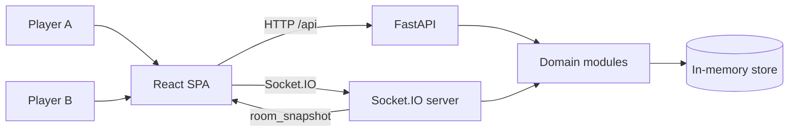
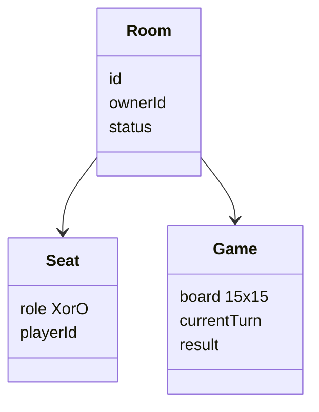
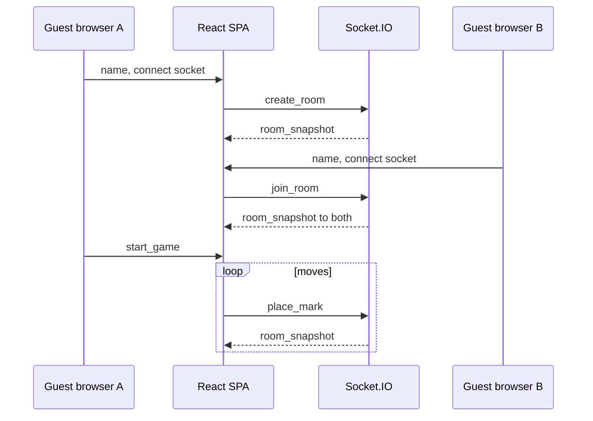

# Caro Online — architecture design (workshop MVP)

| Field | Value |
| --- | --- |
| System | Voodoo AI Native — Caro Online |
| Version | 1.2 |
| Status | Draft — pending review |
| Date | 2026-09-25 |
| Sources | `docs/product-brief.md`, `docs/meeting-notes.md`, `README.md` |

Canonical architecture artifact for this repo. Implementation follows this spec; next step after approval is an implementation plan (`writing-plans`).

---

## 1. Goals

Ship a thin vertical slice in one workshop day:

- Two guest browsers join one room.
- Legal 15×15 Caro with Vietnamese UI.
- Win/draw, board lock, owner-driven **New game** in the same room.
- No accounts. Guest display name remembered for return visits.

---

## 2. Scope

### In scope

| Area | Behavior |
| --- | --- |
| Play | 15×15, X first, alternate turns, empty cells only, ≥5 in a line wins, full board = draw, lock on end |
| Rooms | Create, list joinable, join, leave; max 2 players; creator = owner = X; joiner = O |
| Lifecycle | Owner starts first game; owner starts new game after win/draw with two players still seated; no auto-start |
| Identity | Guest only: display name + cookie `userId`; name in `localStorage`; profile row in SQLite |
| Sync | Live board for both players |
| Demo | Two browsers, both guests |

### Out of scope

See `docs/product-brief.md` — including accounts, sign-up, sign-in, match history, turn clocks, chat, AI, guaranteed reconnect after refresh, room passcodes. Rooms do not survive API restart. Guest profiles do.

### Resolved tensions (sources)

| Topic | Product brief | Meeting notes | This design |
| --- | --- | --- | --- |
| Truth for moves | Older brief said “hosted DB” | In-memory rooms | **Server-authoritative** rooms in one FastAPI process (in-memory) |
| Refresh | Session loss OK | Cookie `userId` | Cookie keeps guest id; **seat/board not restored** |
| Accounts | Older brief had optional login | Sign-in out of scope | **Guests only.** No password, no account table |
| Realtime | Was TBU | API returns state | **Socket.IO** room channel + `room_snapshot` events |
| Remember name | Feature 3 | Name on join | `localStorage` + cookie + **SQLite** guest row |

---

## 3. Technology stack

### Constraints

One workshop day, two-player rooms, no scale SLO, Vietnamese UI. Frontend may use Node 24 (`.envrc`) for tooling; **game rules and rooms live in Python**.

### Options considered

| # | Approach | Verdict |
| --- | --- | --- |
| 1 | Next.js monolith + SSE | Rejected — team chose Python API |
| 2 | FastAPI + Socket.IO + React SPA | **Selected** |
| 3 | Postgres + Supabase Realtime | Rejected — overkill for MVP |

### Selected stack

| Layer | Choice |
| --- | --- |
| **Backend language** | Python 3.12+ |
| **API framework** | FastAPI |
| **Realtime** | Socket.IO via `python-socketio` (ASGI mounted on FastAPI) |
| **Server run** | Uvicorn, **single worker / single instance** |
| **State** | In-process memory (`backend` package modules) |
| **Guest store** | SQLite file (SQLAlchemy or SQLModel). Table `guests(id, display_name)` |
| **Frontend** | React + TypeScript (Vite SPA recommended) |
| **Client realtime** | `socket.io-client` (version compatible with python-socketio) |
| **Guest identity** | HTTP cookie `userId`; `localStorage` display name; SQLite row survives API restart |
| **Backend tests** | `pytest` on pure `game` engine |
| **Frontend tests** | Optional; engine coverage is priority |
| **Dev ergonomics** | Vite `proxy` to FastAPI (`/api`, `/socket.io`) to avoid CORS friction on localhost |

### Rejected

Accounts and password auth, microservices, PostgreSQL for MVP, raw WebSocket without Socket.IO room helpers, mandatory Playwright gate.

### Repository layout (greenfield)

```
backend/
  app/
    main.py              # FastAPI + Socket.IO ASGI app
    api/                 # REST: health, guest ensure, optional room list
    socket/              # event handlers
    domain/
      game/              # pure engine
      rooms/             # registry, lifecycle (memory)
      guests/            # SQLite guest profiles
    sync/                # emit room_snapshot to socket room id
frontend/
  src/
    components/          # board, lobby (Vietnamese)
    socket/              # client gateway, event types
    session/             # cookie + localStorage
```

### Open at implementation (not scope changes)

Exact `python-socketio` / client major versions, full Vietnamese error catalog, production CORS (workshop uses dev proxy).

---

## 4. Principles

1. One vertical slice beats partial features.
2. `domain/game` is pure Python and pytest-tested; server enforces every rule.
3. Every player is a guest. No login gate.
4. Client is a projection of server snapshots only.
5. User-facing copy: Vietnamese only.

---

## 5. System context



---

## 6. Modules

### Client

| Module | Role |
| --- | --- |
| LobbyView | List/create/join; guest display name (prefilled from `localStorage`) |
| BoardView | 15×15 input; keyboard + pointer; lock when ended |
| MatchStatusView | Names, turn, result, owner actions (Vietnamese) |
| ClientSession | Cookie `userId` + `localStorage` name; send both on socket connect |
| GameClientGateway | `socket.io-client`; emit commands; listen `room_snapshot` |

### Server (single Python process)

| Module | Role |
| --- | --- |
| RoomRegistry | Rooms, seats, owner, join/leave, empty cleanup |
| MatchLifecycle | `start_game`, `start_new_game` guards |
| GameEngine | Board, turns, win/draw |
| CommandGuard | Illegal move / wrong actor rejection |
| StateProjector | Canonical snapshot dict / Pydantic model |
| SocketBroadcaster | `emit` `room_snapshot` to Socket.IO room |
| GuestStore | SQLite: upsert guest `id` + `display_name` |

**Dependency rule:** Socket/REST handlers → domain. Rooms in memory. Guests in SQLite. Never trust client for board truth.

### Domain operations (server-side)

Same logical API as before; invoked from Socket.IO handlers (and REST where noted):

| Area | Operations |
| --- | --- |
| Rooms | `list_available_rooms`, `create_room`, `join_room`, `leave_room` |
| Match | `start_game`, `start_new_game` |
| Play | `place_mark`, `get_snapshot` |
| Guests | `ensure_guest(id, display_name)` |

---

## 7. Socket.IO contract

Use one Socket.IO connection per browser tab. After connect, client sends guest `userId` and display name. Server upserts the SQLite guest row, then accepts room commands.

### Client → server (events)

| Event | Payload (conceptual) | Notes |
| --- | --- | --- |
| `subscribe_room` | `room_id` | Join Socket.IO room for pushes; validate seated or lobby rules |
| `list_rooms` | — | Optional; can be REST `GET /api/rooms` instead |
| `create_room` | `display_name` | Returns snapshot; auto-subscribe |
| `join_room` | `room_id`, `display_name` | Display name required |
| `leave_room` | `room_id` | |
| `start_game` | `room_id` | Owner only |
| `start_new_game` | `room_id` | Owner only |
| `place_mark` | `room_id`, `row`, `col` | |

Server responds to invalid commands with `error` event (Vietnamese message code or text).

### Server → client (events)

| Event | Payload |
| --- | --- |
| `room_snapshot` | Full canonical room + game state |
| `error` | `{ code, message }` Vietnamese |

After every successful mutation, server emits `room_snapshot` to all sockets in that Socket.IO room.

### REST (FastAPI)

| Route | Purpose |
| --- | --- |
| `POST /api/guests` | Ensure guest: body `id` + `display_name`; sets cookie; upserts SQLite |
| `GET /api/health` | Workshop smoke check |
| `GET /api/rooms` | Optional lobby list (duplicate of socket OK for simplicity) |

Game mutations stay on Socket.IO so push and command share one connection.

---

## 8. Domain



- **Win:** ≥5 consecutive marks, any straight line.
- **Draw:** 225 cells filled, no winner.

---

## 9. Runtime

### Happy path (demo)



### Command pipeline

Identify guest → load room → check owner or seat → validate → mutate → evaluate end → `emit room_snapshot`.

---

## 10. Data (logical)

| Entity | Fields (conceptual) |
| --- | --- |
| Guest (SQLite) | `id`, `display_name` |
| Room (memory) | `id`, `owner_id`, seats, `status`, optional `game` |
| Game (memory) | `cells`, `current_turn`, `result`, optional `winner_id` |

No match history. No account table. Rooms and games die on process restart. Guest rows remain in the SQLite file.

---

## 11. Security (MVP)

No passwords. Server validates every move. Dev: Vite proxy to API.

Socket.IO: require guest `userId` on each event; do not trust client board state. Cookie is an identifier, not a secret session.

---

## 12. Deployment

- **Workshop:** `uvicorn` one worker + Vite dev server (or built static files served by FastAPI `StaticFiles` for single-port demo).
- No multi-instance until shared store + Socket.IO message queue (out of MVP).

---

## 13. Decisions

| ID | Decision |
| --- | --- |
| D1 | FastAPI backend + React SPA (split deployable units, one repo) |
| D2 | Server authoritative; client renders `room_snapshot` |
| D3 | Guests only. No accounts, passwords, or login |
| D4 | Owner-only start / new game |
| D5 | 15×15, ≥5 to win |
| D6 | Rooms in memory, single API process |
| D7 | **Socket.IO** for game commands and snapshot push |
| D8 | No turn timer in MVP |
| D9 | Guest name in `localStorage`; guest row in SQLite |
| D10 | Refresh does not restore board |
| D11 | `POST /api/guests` ensures profile; game stays on Socket.IO |

---

## 14. Quality attributes

| Attribute | Target |
| --- | --- |
| Language | Vietnamese UI |
| Access | Guest name only |
| Capacity | 2 / room |
| A11y | Keyboard board, focus, contrast, cell labels |
| Tests | Python engine unit tests |

---

## 15. Risks

| Risk | Mitigation |
| --- | --- |
| Multiple uvicorn workers | One worker; or document in-memory limitation |
| CORS / two origins in dev | Vite proxy to FastAPI |
| socket.io version mismatch | Pin compatible python-socketio + client versions |
| Refresh confusion | Vietnamese copy: rejoin not guaranteed |

---

## 16. Traceability

| Design area | Product | Stories |
| --- | --- | --- |
| GameEngine | Play Caro | US-04 |
| Rooms + Socket.IO | Online room | US-01, US-03 |
| GuestStore + ClientSession | Remember name | Brief feature 3 |

---

## 17. After approval

1. Review this file.
2. Invoke `writing-plans` for implementation plan.
3. Scaffold `backend/` (FastAPI + Socket.IO) and `frontend/` (Vite React) per §3 layout.
