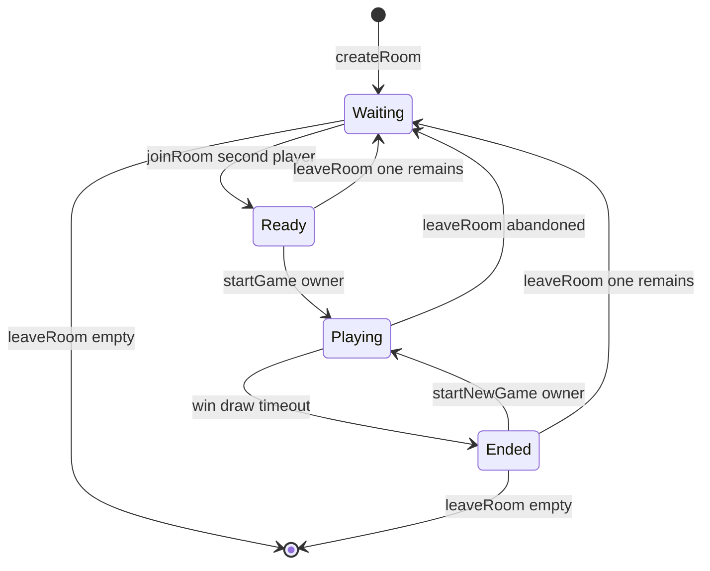
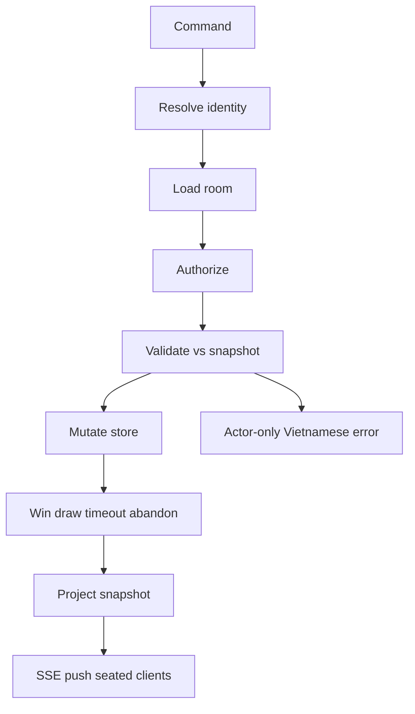

# Business Logic Model — `caro-online-mvp`

Technology-agnostic. Stack stays TBU.

Closed Functional Design answers (2026-09-21): Q1=A, Q2=A, Q3=A, Q4=A, Q5=A, Q6=B, Q7=A, Q8=A.

## Processes

| Process | Trigger | Result |
| --- | --- | --- |
| Enter as guest | Display name submitted | userId issued (cookie allowed); not seated yet |
| Sign up / log in | Auth form from lobby (not while seated) | Account session; display name = account name |
| Log out | From lobby | Session cleared; guest play still allowed |
| Create room | Seated identity | Room Waiting; actor owner and X |
| List lobby | Open lobby | Joinable rooms only (see rules) |
| Join room | Room id + identity | Second seat O; Ready if two seated |
| Start game | Owner, two seated, not Playing | New Game Playing; empty board; X to move; `deadlineAt` set |
| Place mark | Seated player, Playing | Cell filled or actor-only error |
| Turn timeout | Server clock >= `deadlineAt` | Current turn loses; Ended Timeout; board locked |
| Win | Five or more in a line after a legal mark | Ended Win; `winningCells`; board locked |
| Draw | 225 filled, no win | Ended Draw; board locked |
| New game | Owner, Ended Win or Draw, two seated | New Playing board; X first; new `deadlineAt` |
| Leave (Playing) | Either seat | Abandoned; not a win; opponent message; remapped Waiting or delete |
| Leave (Waiting/Ready) | Either seat | Occupancy update; owner/X transfer if needed; delete if empty |
| SSE drop (tab alive) | Stream error | Reconnect + GET snapshot; lobby if room gone |
| Refresh / tab close | Browser reload | Cookie identity may remain; match not restored |

Abandoned is **not** Win. Next match uses **Start Game** after two players sit again, not New Game.

---

## Room state machine

### Text alternative

- New room: Waiting.
- Second join: Ready. Leave from Ready with one left: Waiting.
- Empty: room deleted.
- Owner Start Game from Ready: Playing.
- Playing ends Win / Draw / Timeout: Ended (board locked).
- Playing + leave: Abandoned, then Waiting if one remains.
- Ended + New Game (win/draw only, two seated): Playing.
- Abandoned does not unlock New Game.

---

## Command pipeline

### Text alternative

Identity → load room → authorize → validate. Fail: actor-only error, store unchanged, no SSE error event. Success: mutate, evaluate end, project snapshot, SSE push to seated clients.

GET snapshot is the same projector. Used after SSE reconnect. Not used as primary live sync.

---

## Place-mark algorithm

1. Reject if room missing, not Playing, actor not seated, not actor's turn, cell out of 0..14, cell occupied, or result already set.
2. Write X or O into `cells[row][col]`.
3. From that cell, count consecutive same marks on four axes: horizontal, vertical, diagonal down-right, diagonal down-left. An axis total is both directions plus the cell.
4. If any axis total >= 5: result Win, record `winningCells` (the consecutive cells on that axis, five or more), lock board, clear `deadlineAt`.
5. Else if every cell filled: result Draw, lock, clear `deadlineAt`.
6. Else: switch `currentTurn`, bump `turnId`, set `deadlineAt` = now + 20 seconds.
7. Push snapshot.

Timeout job holds `turnId`. If `turnId` changed, ignore the job.

---

## Leave-while-Playing algorithm

1. Remove actor from seats.
2. Set game result Abandoned. Clear `deadlineAt`. Do not set winner.
3. If zero seats: delete room.
4. If one seat remains:
   - Remaining player becomes owner.
   - Remaining player occupies seat X. Seat O empty.
   - Room status Waiting.
   - Push snapshot to remaining client with Vietnamese notice `opponentLeft`.
5. Leaver's client returns to lobby. No board resume.

---

## Owner leave before start

1. Remove owner.
2. If empty: delete room.
3. If O remains: that player becomes owner and seat X; status Waiting; push snapshot.

---

## Identity vs seat (Q6=B)

Login and sign-up run only from lobby, not while seated. To use an account name in a room, leave first, log in, then create or join. Logout while seated is treated as leave, then session clear.

Guest cookie userId may survive refresh. Room membership does not.
