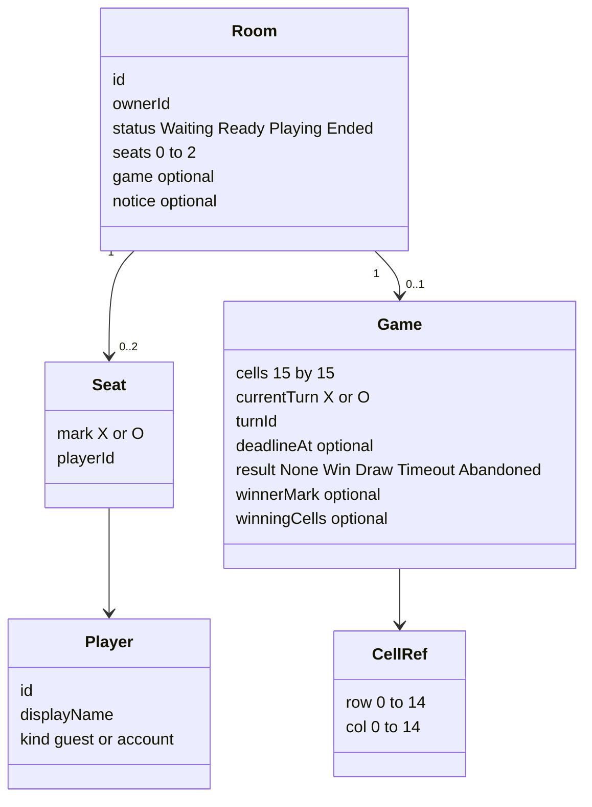

# Domain Entities — `caro-online-mvp`

Logical types. Not a database schema. In-memory maps are enough.

### Text alternative

Room owns seats and at most one Game. Game owns 225 cells, turn clock fields, and result. `winningCells` is a list of CellRef on Win.

---

## Player

| Field | Meaning |
| --- | --- |
| `id` | Stable userId (guest generated or account id) |
| `displayName` | Shown in room |
| `kind` | `guest` or `account` |

Account also has email + password verifier, stored only in Auth module, not in room snapshots.

---

## Seat

| Field | Meaning |
| --- | --- |
| `mark` | `X` or `O` |
| `playerId` | Occupant |

---

## Room

| Field | Meaning |
| --- | --- |
| `id` | Public room id (lobby join key) |
| `ownerId` | Player allowed to Start / New Game |
| `status` | `Waiting` (0–1 seated), `Ready` (2 seated, not Playing), `Playing`, `Ended` |
| `seats` | 0–2 Seat |
| `game` | Present after first Start Game until room deleted; may be Ended or Abandoned |
| `notice` | Optional code for UI, e.g. `opponentLeft` |

Lobby summary: `id`, owner display name, seat count. No Playing rooms. No full rooms.

---

## Game

| Field | Meaning |
| --- | --- |
| `cells[r][c]` | `empty` \| `X` \| `O` |
| `currentTurn` | `X` or `O` while Playing |
| `turnId` | Monotonic per turn; binds timeout jobs |
| `deadlineAt` | Server instant; null when not Playing |
| `result` | `None` \| `Win` \| `Draw` \| `Timeout` \| `Abandoned` |
| `winnerMark` | Set on Win and Timeout (opponent of timed-out player). Null on Draw and Abandoned |
| `winningCells` | Ordered CellRef list, length >= 5, on Win only |

Snapshot = Room + seated Player public fields + Game. No passwords. No opponent error text.

---

## Command error (actor only)

| Field | Meaning |
| --- | --- |
| `code` | Stable machine code (`notYourTurn`, `cellOccupied`, `notOwner`, `roomGone`, ...) |
| `message` | Vietnamese string |

Not part of the room snapshot.

---

## Invariants

1. At most one owner. Owner always occupies X after any remapping.
2. Playing implies two seats and `result = None` and `deadlineAt` set.
3. Ended implies board locked and `deadlineAt` null.
4. Abandoned implies not Playing; `winnerMark` null.
5. `winningCells` empty unless `result = Win`.
