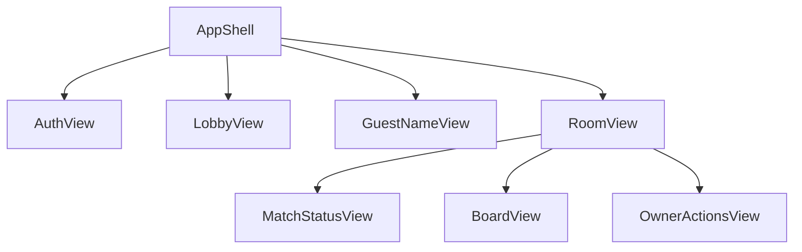

# Frontend Components — `caro-online-mvp`

Views, not a framework. All copy Vietnamese.

### Text alternative

AppShell hosts AuthView (lobby only), GuestNameView, LobbyView, and RoomView. RoomView hosts MatchStatusView, BoardView, OwnerActionsView.

---

## AppShell

| | |
| --- | --- |
| State | `identity`, `screen` (`lobby` \| `room`), `roomSnapshot`, `actorError`, `sseStatus` |
| Behavior | Route lobby vs room. Hold SSE subscription while `screen = room`. On SSE drop: reconnect, GET snapshot, or `phòng không còn` + lobby (Q8=A). Refresh: start at lobby; do not rehydrate board. |

---

## GuestNameView

| | |
| --- | --- |
| Visible | Guest with empty display name, lobby |
| Input | Display name |
| Action | Persist name on identity; enable create/join |

---

## AuthView

| | |
| --- | --- |
| Visible | Lobby only (Q6=B). Hidden while seated |
| Actions | Sign up, log in, log out |
| Integration | `signUp`, `logIn`, `logOut` |
| After login | Stay in lobby; account name used on next create/join |

---

## LobbyView

| | |
| --- | --- |
| Data | `listAvailableRooms` summaries |
| Actions | Create room; join listed room |
| Integration | `createRoom`, `joinRoom`, `listAvailableRooms` |
| Errors | Actor-only, e.g. room gone or full |

---

## RoomView

| | |
| --- | --- |
| Data | Current snapshot via SSE + initial GET |
| On leave | `leaveRoom`; back to lobby |
| Notice | If `notice = opponentLeft`, show đối thủ đã rời |

---

## MatchStatusView

| Prop / data | Use |
| --- | --- |
| Names + marks | Both seats |
| Turn | Whose turn |
| `deadlineAt` | Local countdown only (Q4=A) |
| Result | Vietnamese win / draw / timeout / abandoned |

---

## BoardView

| | |
| --- | --- |
| Render | 15×15. Each cell: name/label, focus, keyboard |
| Input | Activate empty cell on own turn while Playing |
| Integration | `placeMark` |
| Lock | All results except None; also not your turn |
| Win | Highlight `winningCells` (Q5=A) |
| Error | Show `actorError` locally; board stays on last snapshot (Q7=A) |

---

## OwnerActionsView

| Action | Visible when |
| --- | --- |
| Start Game | Actor is owner, status Ready |
| New Game | Actor is owner, Ended, result Win or Draw, two seated |
| Hidden | Everyone else; Timeout; Abandoned; Waiting |

---

## Command vs SSE

| Client call | Channel |
| --- | --- |
| create/join/leave/start/new/place, auth | Same-origin command |
| Live board/status | SSE snapshot |
| After SSE reconnect | GET snapshot then SSE |
| Illegal move / not owner | Command response error only |

Do not send marks on the SSE channel. Do not poll as the primary sync path.
