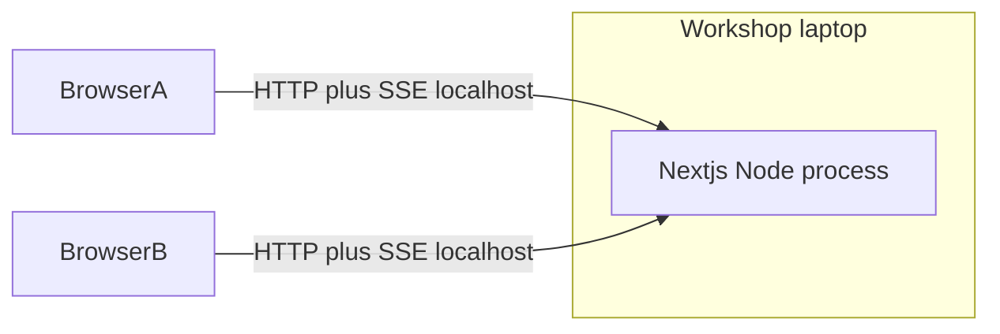

# Deployment Architecture — `caro-online-mvp`

### Text alternative

Two browsers on the same machine (or LAN) call one Next.js Node process at localhost. That process holds RAM state, timers, and SSE. Nothing else is deployed.

## Run

1. Install Node.js LTS on the laptop.
2. App lives at workspace root (created in Code Generation).
3. Dev: `next dev`.
4. Demo: `next build` && `next start`. Do not start a second instance.
5. Open two browsers to the same origin. Guest in one, optional login in the other.

## Constraints

- One OS process. A second `next start` = split-brain rooms and broken SSE.
- Stop/crash = empty lobby.
- No container, no reverse proxy, no cloud DNS.
- stdout is the ops console.

## Operations placeholder

AI-DLC Operations stage is unused. Demo runbook = commands above.
