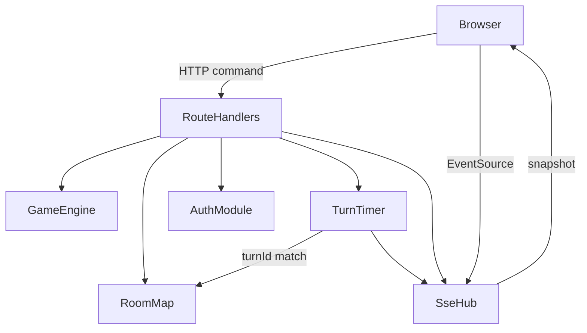

# Logical Components — `caro-online-mvp`

All in one Next.js Node process. No extra infrastructure services.

### Text alternative

Browser sends HTTP commands to Route Handlers and opens EventSource to SseHub. Handlers use GameEngine, RoomMap, AuthModule, TurnTimer. TurnTimer and handlers publish snapshots through SseHub. No external broker.

---

## Components

| Component | Kind | Role |
| --- | --- | --- |
| Route Handlers | HTTP | Commands: create/join/leave/start/new/place, GET snapshot, auth |
| GameEngine | Pure module | Legal move, win/draw, `winningCells` |
| RoomMap | In-memory Map | Rooms, seats, games |
| TurnTimer | `setTimeout` table | Keyed by `roomId` + `turnId`; ignore stale |
| SseHub | In-memory Set per room | Fan-out snapshot; drop writer on leave/close |
| AuthModule | In-memory accounts | Hash passwords; sessions |
| App Router UI | Next.js | Vietnamese pages; client board + EventSource |

## Not present

Queue, Redis, cache, worker, proxy, load balancer, circuit breaker, metrics backend.

## Failure mapping

| Failure | Behavior |
| --- | --- |
| Process exit | RoomMap, timers, SSE writers gone |
| HTTP command fail | No store change (or already applied once); actor error; no auto retry |
| SSE drop, tab alive | EventSource reconnect + GET snapshot |
| Refresh | Lobby. Cookie userId may remain |
